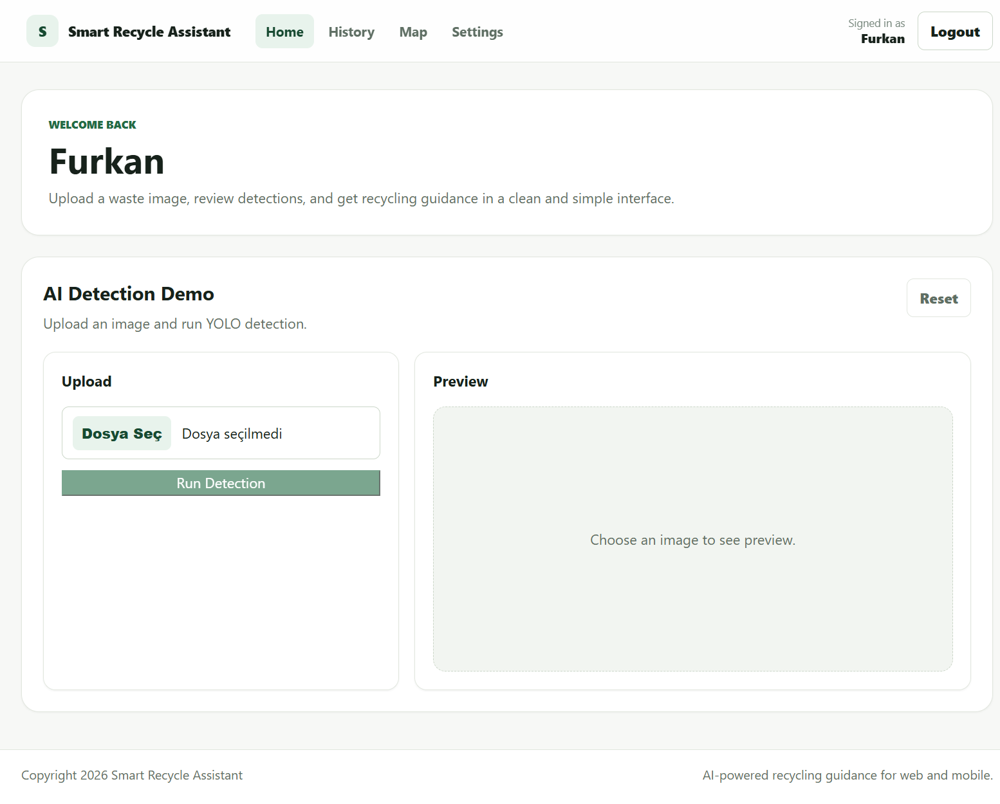
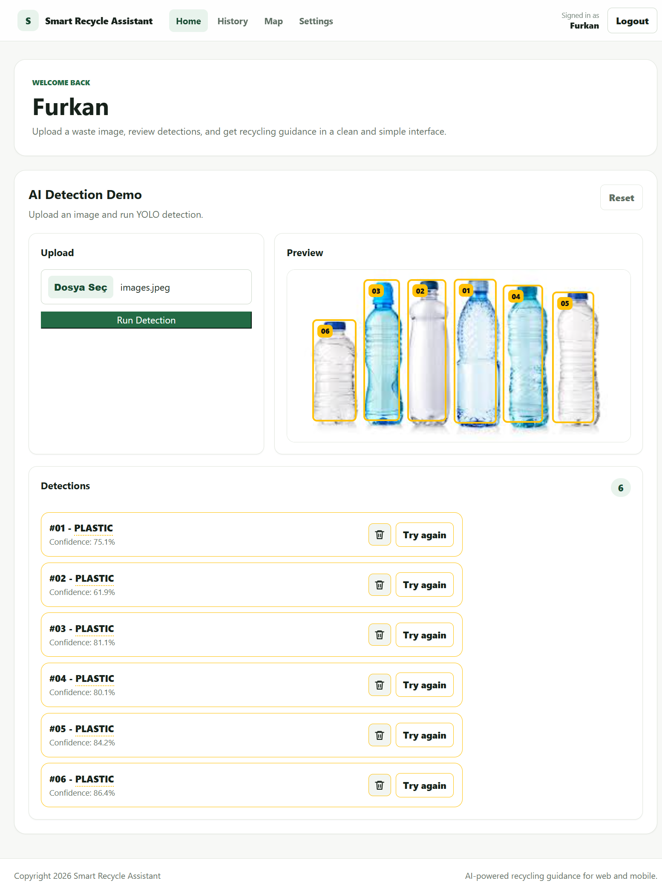
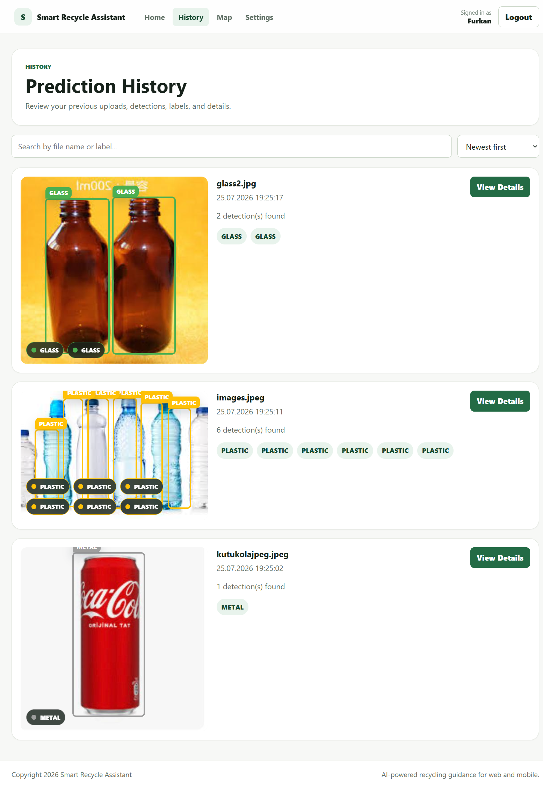
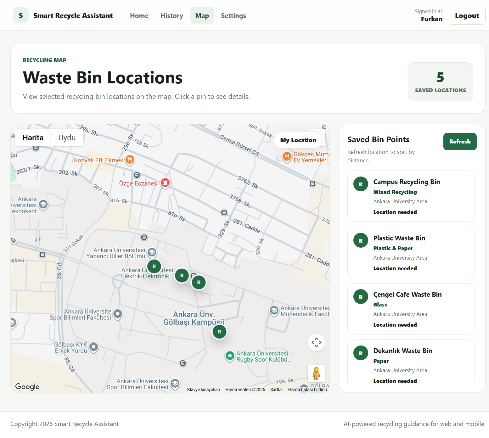
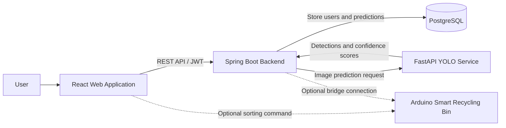

<div align="center">

# ♻️ Smart Recycling Assistant

### An AI-powered waste detection and recycling guidance platform

Smart Recycling Assistant identifies recyclable waste from images, recommends the appropriate recycling category, stores prediction history, displays nearby recycling points, and supports integration with an Arduino-based smart recycling bin.

<br />


<br />



</div>

---

## Table of Contents

* [About the Project](#about-the-project)
* [Features](#features)
* [Supported Waste Categories](#supported-waste-categories)
* [Screenshots](#screenshots)
* [System Architecture](#system-architecture)
* [Technology Stack](#technology-stack)
* [Project Structure](#project-structure)
* [Getting Started with Docker](#getting-started-with-docker)
* [Configuration](#configuration)
* [Service URLs](#service-urls)
* [Useful Docker Commands](#useful-docker-commands)
* [Health Checks](#health-checks)
* [Roadmap](#roadmap)
* [Contributing](#contributing)
* [Team](#team)

---

## About the Project

Incorrect waste sorting reduces recycling efficiency and causes recyclable materials to end up in landfills.

**Smart Recycling Assistant** provides an accessible solution by combining computer vision, web technologies, and optional smart-bin hardware integration.

Users can upload an image containing waste objects. The system detects the objects using a YOLO model, displays their locations with bounding boxes, reports confidence scores, and recommends the appropriate recycling category.

The platform also allows registered users to review their previous predictions and explore selected recycling bin locations through an interactive map.

---

## Features

* **AI-powered waste detection** using an Ultralytics YOLO model
* **Multiple-object detection** within a single image
* **Bounding-box visualization** for detected waste objects
* **Confidence scores** for every detection
* **Recycling bin color recommendations**
* **User registration and JWT-based authentication**
* **Personal prediction history**
* **Searchable and sortable history records**
* **Interactive recycling bin map**
* **User location and distance-based bin sorting**
* **Alternative prediction attempt** for cropped detections
* **Optional Arduino smart-bin integration**
* **Containerized development environment** with Docker Compose

---

## Supported Waste Categories

The current AI model supports the following categories:

| Category      | Suggested Color |
| ------------- | --------------- |
| Biodegradable | Green           |
| Cardboard     | Brown           |
| Glass         | Green           |
| Metal         | Gray            |
| Paper         | Blue            |
| Plastic       | Yellow          |

> Recycling colors may differ between municipalities and countries. The recommendations in this project are intended for demonstration purposes.

---

## Screenshots

<table>
  <tr>
    <td align="center">
      
      <br />
      <strong>AI Waste Detection</strong>
    </td>
    <td align="center">
      
      <br />
      <strong>Prediction History</strong>
    </td>
  </tr>
  <tr>
    <td align="center" colspan="2">
      
      <br />
      <strong>Recycling Bin Map</strong>
    </td>
  </tr>
</table>

---

## System Architecture



### Application Flow

1. The user registers or signs in through the web application.
2. The user uploads an image containing one or more waste objects.
3. The Spring Boot backend sends the image to the FastAPI AI service.
4. The YOLO model detects waste objects in the image.
5. Detection results are returned with labels, confidence scores, and bounding boxes.
6. The backend stores the prediction and uploaded image in the user's history.
7. The web application visualizes the results and recycling recommendations.
8. When configured, a sorting command can be sent to the smart recycling bin.

---

## Technology Stack

### Frontend

* React 19
* Vite
* React Router
* Google Maps JavaScript API
* Web Serial API for optional Arduino communication

### Backend

* Java 17
* Spring Boot 3
* Spring Security
* JSON Web Tokens
* Spring Data JPA
* Maven

### Artificial Intelligence

* Python
* FastAPI
* Ultralytics YOLO
* PyTorch
* Pillow
* NumPy

### Database

* PostgreSQL 16

### Mobile Application

* React Native
* Expo

> The mobile application is included in the repository but is not currently started by the Docker Compose configuration described below.

### Infrastructure

* Docker
* Docker Compose

---

## Project Structure

```text
Smart-Recycling-Assistant/
├── apps/
│   ├── ai-service/        # FastAPI and YOLO inference service
│   ├── backend/           # Spring Boot REST API
│   ├── mobile/            # Expo React Native application
│   └── web/               # React and Vite web application
├── docs/
│   └── images/            # README screenshots
├── infra/
│   └── docker/
│       ├── docker-compose.yml
│       └── .env.example
└── README.md
```

---

## Getting Started with Docker

The Docker Compose configuration starts the following services:

* PostgreSQL database
* FastAPI AI service
* Spring Boot backend
* React web application

### Prerequisites

Install the following tools before starting:

* [Git](https://git-scm.com/)
* [Docker Desktop](https://www.docker.com/products/docker-desktop/)

Docker Compose is included with current Docker Desktop installations.

### 1. Clone the Repository

```bash
git clone https://github.com/Team-FurZe/Smart-Recycling-Assistant.git
cd Smart-Recycling-Assistant
```

### 2. Open the Docker Directory

```bash
cd infra/docker
```

### 3. Create the Environment File

#### macOS or Linux

```bash
cp .env.example .env
```

#### Windows Command Prompt

```cmd
copy .env.example .env
```

#### Windows PowerShell

```powershell
Copy-Item .env.example .env
```

The Google Maps API key is optional. The rest of the application can run without it.

To enable the Recycling Map page, open `.env` and add your key:

```env
VITE_GOOGLE_MAPS_API_KEY=your_google_maps_api_key
```

### 4. Build and Start the Application

```bash
docker compose up --build
```

To run the containers in the background:

```bash
docker compose up -d --build
```

### 5. Open the Web Application

Open the following address in your browser:

```text
http://localhost:5173
```

Create an account from the sign-up page and sign in to begin uploading waste images.

---

## Configuration

Docker Compose reads environment variables from:

```text
infra/docker/.env
```

Available configuration:

| Variable                   | Required | Description                                |
| -------------------------- | -------: | ------------------------------------------ |
| `VITE_GOOGLE_MAPS_API_KEY` |       No | Enables the Google Maps recycling-bin page |

Do not commit the `.env` file or expose private API keys in the repository.

For production usage, database passwords and JWT secrets should also be moved to environment variables and replaced with secure values.

---

## Service URLs

| Service         | Address                 |
| --------------- | ----------------------- |
| Web Application | `http://localhost:5173` |
| Backend API     | `http://localhost:8080` |
| AI Service      | `http://localhost:8001` |
| PostgreSQL      | `localhost:5432`        |

---

## Useful Docker Commands

Run these commands from the `infra/docker` directory.

### View Container Status

```bash
docker compose ps
```

### View Logs

```bash
docker compose logs -f
```

### View Logs for One Service

```bash
docker compose logs -f backend
```

Other service names include:

```text
web
ai-service
postgres
```

### Rebuild the Application

Use this command after changing source code, dependencies, Dockerfiles, or configuration:

```bash
docker compose up -d --build
```

### Stop the Application

```bash
docker compose down
```

### Stop the Application and Delete Stored Data

```bash
docker compose down -v
```

> Warning: This command removes the PostgreSQL data and backend upload volumes.

---

## Health Checks

### AI Service

```bash
curl http://localhost:8001/yolo/health
```

Example response:

```json
{
  "status": "ok",
  "device": "cpu"
}
```

Depending on the available hardware, the device may be reported as `cpu`, `cuda`, or `mps`.

### Backend Service

```bash
curl http://localhost:8080/api/v1/health
```

Example response:

```json
{
  "status": "ok"
}
```

---

## Troubleshooting

### A port is already in use

The project uses the following default ports:

```text
5173, 8080, 8001, 5432
```

Stop the application that is using the required port or update the corresponding port mapping in `docker-compose.yml`.

### The map does not load

Make sure that:

* `VITE_GOOGLE_MAPS_API_KEY` exists in `infra/docker/.env`.
* The Maps JavaScript API is enabled for the Google Cloud project.
* The web container was rebuilt after changing the environment variable.

Rebuild the web application with:

```bash
docker compose up -d --build web
```

### The AI service is unhealthy

Check its logs:

```bash
docker compose logs -f ai-service
```

Make sure the YOLO model file exists in the expected model directory.

### The backend cannot connect to PostgreSQL

Check the service status:

```bash
docker compose ps
```

Then inspect the backend and database logs:

```bash
docker compose logs backend postgres
```

### Reset the local environment

The following command deletes the local database and uploaded files before rebuilding the project:

```bash
docker compose down -v
docker compose up --build
```

---

## Roadmap

Potential future improvements include:

* Real-time camera detection
* Dynamically managed recycling-bin locations
* Improved recycling recommendations
* Model performance and dataset documentation
* Automated tests and continuous integration
* Production-ready deployment configuration
* Fully containerized mobile development workflow
* Expanded smart-bin hardware support

---

## Contributing

Contributions, issues, and feature suggestions are welcome.

To contribute:

1. Fork the repository.
2. Create a new branch.
3. Commit your changes with a descriptive commit message.
4. Push the branch to your fork.
5. Open a pull request.

Please avoid committing environment files, API keys, generated build files, uploaded images, or local database data.

---

## Team

Developed by **Team FurZe** as a computer engineering graduation project.

Repository: [Team-FurZe/Smart-Recycling-Assistant](https://github.com/Team-FurZe/Smart-Recycling-Assistant)

Contributors can be viewed on the repository's [contributors page](https://github.com/Team-FurZe/Smart-Recycling-Assistant/graphs/contributors).

---

<div align="center">

Made with ♻️, artificial intelligence, and software engineering.

</div>
